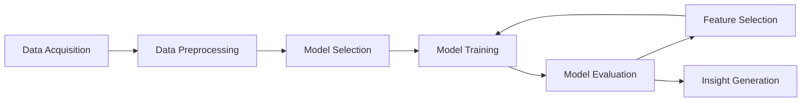

# Breast Cancer and Diamonds Regression Analysis

> **Foundational Regression Analysis on Breast Cancer and Diamonds Datasets:** This project employs linear and logistic regression models to analyze breast cancer and diamonds datasets, respectively. The goal is to demonstrate the application of regression techniques in predicting outcomes and identifying key features influencing these predictions. The breast cancer analysis aims to *distinguish between benign and malignant tumors*, while the diamonds analysis focuses on *predicting diamond prices* based on various features. Accompanied by tutorial-like guidance and additional resources within the notebooks, this project serves as an accessible entry point for learners exploring regression techniques.

## :bookmark_tabs: Table of Contents
- [Project Files Overview](#project-files-overview)
- [Workflow](#workflow)
- [Results](#results)
- [Future Ideas](#future-ideas)
- [Usage](#usage)
- [Get Involved](#get-involved)
- [Sources](#sources)
- [Credits](#credits)
- [License](#license)

## :open_file_folder: Project Files Overview

- `diamonds.csv`: Dataset containing features of diamonds which are used for the linear regression analysis.
- `Breast_cancer_data.csv`: Dataset containing features of breast cancer observations used for logistic regression analysis.
- `breast_cancer_metadata.txt`: Metadata providing descriptions of the features in the breast cancer dataset. The dataset includes information on diagnosis, mean radius, mean texture, mean perimeter, mean area, and mean smoothness.
- `diamonds_multi_lin_reg.ipynb`: Jupyter notebook demonstrating the application of multiple linear regression on the diamonds dataset. Includes Forward Feature selection with Sequential Feature Selector.
- `breast_cancer_log_reg.ipynb`: Jupyter notebook illustrating logistic regression analysis on the breast cancer dataset to predict malignancy. Includes Forward Feature selection with Sequential Feature Selector.

## :repeat: Workflow

## :heavy_check_mark: Results
| Insight                                | Recommendation                     |
|:---------------------------------------|:-----------------------------------|
| After feature selection (9), **Diamonds** model achieved R2 of 91.25% and RMSE of ~1061$. | Suitable for quick preliminary diamond price estimates. |
| **Breast Cancer** model reached 96.55% accuracy. | Not recommended for standalone clinical use. Applicable for initial screenings. |

## :bulb: Future Ideas
| Idea                               | Implemented On |
|:-----------------------------------|:--------------:|
| *Awaiting your suggestions* | TBD            |

## :ledger: Usage
**Viewing `.ipynb` Files**

- **On GitHub:** Simply navigate to the file in the repository. GitHub renders Jupyter Notebooks automatically.
- **Online:** Use [nbviewer](https://nbviewer.jupyter.org/) by pasting the URL of the notebook from GitHub.
- **Locally:** First, download the folder. Then, install [Anaconda](https://www.anaconda.com/download) to access Jupyter Notebooks or JupyterLab for viewing.

**Viewing `.csv` Files**
- **On GitHub:** Navigate to the `.csv` file(s) in the repository. GitHub directly renders small CSV files. In case it doesn't show, click on View raw.
- **Online:** Download and import the `.csv` in tools like [Google Sheets](https://sheets.google.com) or an online [CSV Viewer](https://jumpshare.com/viewer/csv).
- **Locally:** Download the `.csv` file(s) and open using Notepad, Microsoft Excel or LibreOffice Calc.

## :point_right: Get Involved
:gem: Excited by what you see? Has it helped you? Give a :star2:! Your support illuminates my journey.
 :gem: Eager to tinker and tailor? :trident: the project, and unleash your creativity!
 :gem: Got ideas or feedback? Reach out to me by [email](mailto:asmonaite.s@gmail.com) or comment in the [Discussions page](https://github.com/simonaasm/lin-log-regs-example/discussions). Looking forward to hearing from you! 🤝

## :link: Sources
- Dataset: Breast Cancer Prediction dataset available on [Kaggle](https://www.kaggle.com/datasets/merishnasuwal/breast-cancer-prediction-dataset).
- Dataset: Diamonds dataset available on [Kaggle](https://www.kaggle.com/datasets/shivam2503/diamonds).

## :trophy: Credits

Credits noted in `.ipynb` files.

## :memo: License

This project is under [MIT](https://choosealicense.com/licenses/mit/) license.
